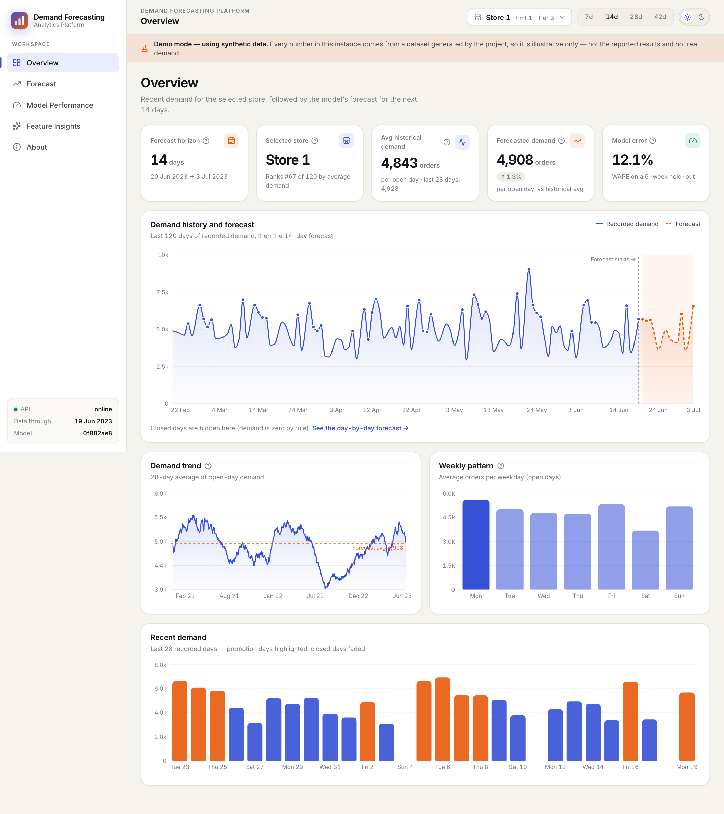
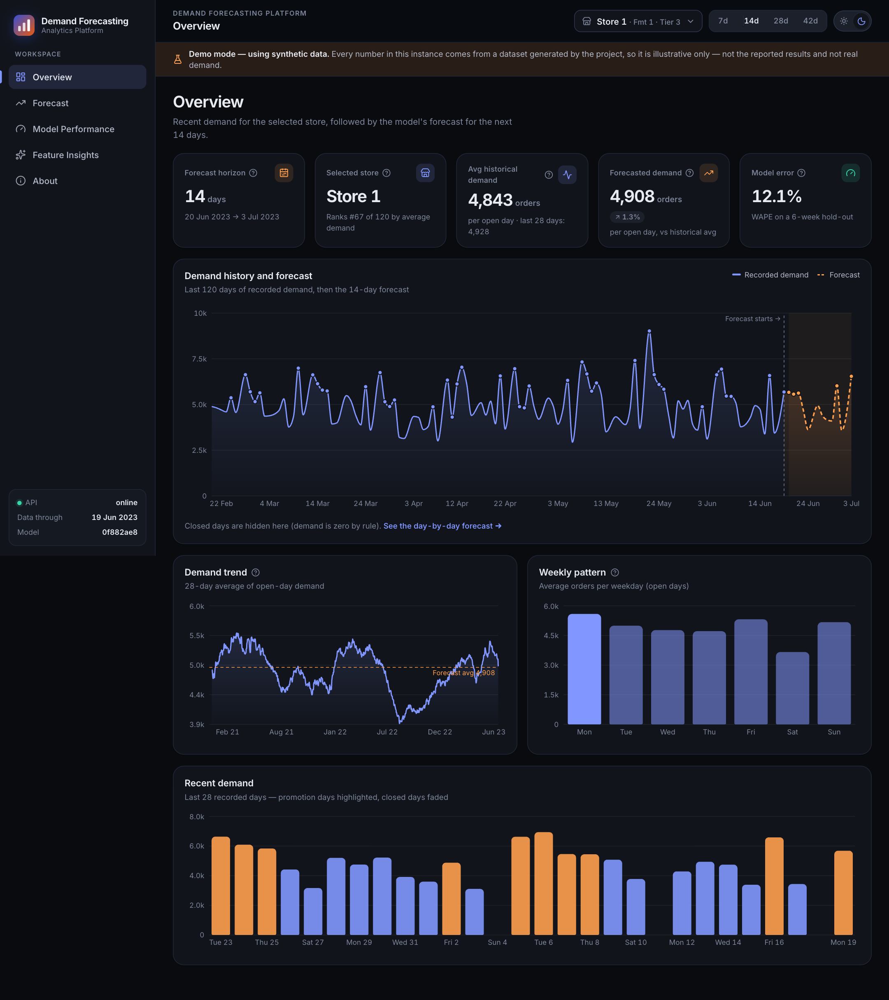
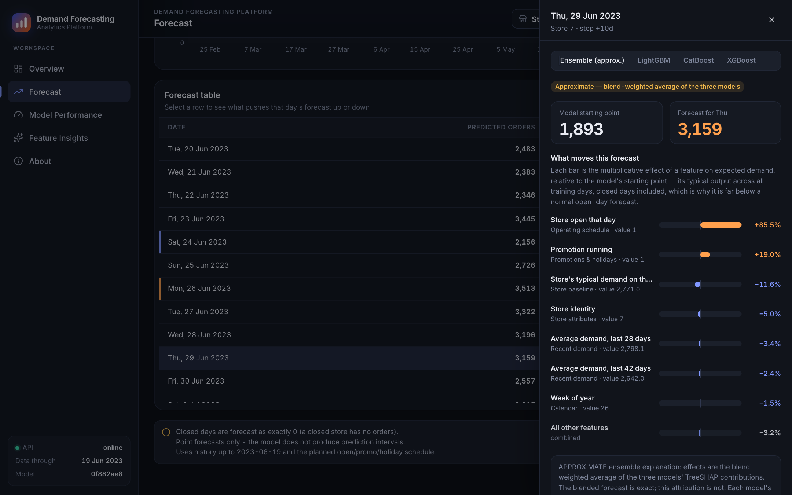
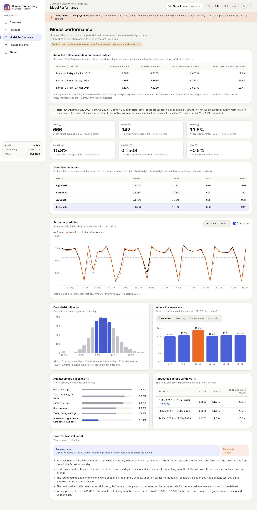
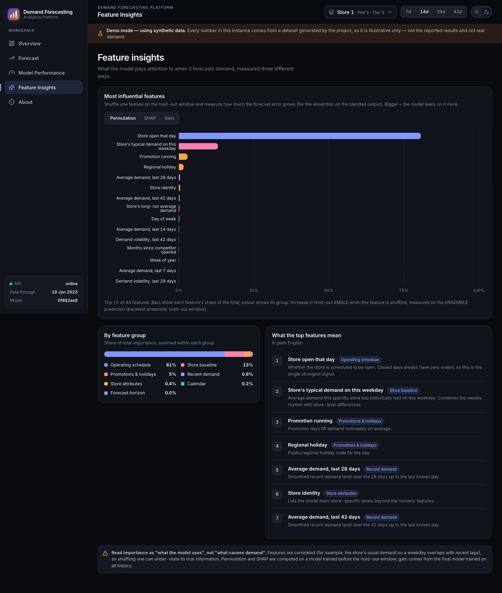
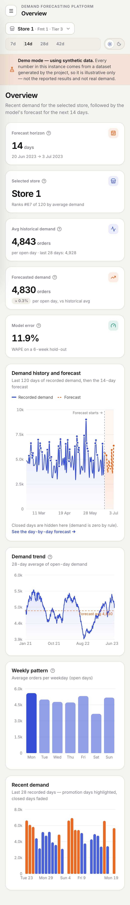
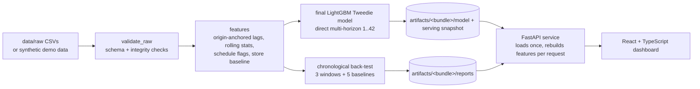

# Demand Forecasting & Analytics Platform

An end-to-end machine-learning project that forecasts daily demand for 1,115 stores up to 42 days ahead — data validation, temporal feature engineering, chronological back-testing, a LightGBM model, a FastAPI service and an interactive React dashboard.

**Live demo:** https://demand-forecasting-platform-eight.vercel.app/ · **Repository:** https://github.com/AdityaKishore0698/demand-forecasting-platform

| Overview (light) | Overview (dark) |
|---|---|
|  |  |

<details>
<summary>More screenshots</summary>

| Forecast + "what moves this forecast" drawer | Model performance |
|---|---|
|  |  |

| Feature insights | Mobile |
|---|---|
|  |  |

</details>

> **Demo mode.** The screenshots, the bundled model and any public deployment use a **synthetic dataset** generated by this repository (`make demo`); the app shows a "Demo mode — using synthetic data" banner. The validation results below were measured on the real dataset, which is **not included** — see [Dataset](#dataset).

---

## Problem statement

Businesses that fulfil demand from many locations must plan staffing and stock weeks ahead. Given each store's daily order history, this project predicts **how many orders each store will receive on each of the next 1–42 days**, and shows how trustworthy and explainable those forecasts are. The series are related (shared weekly rhythm, promotions, holidays), have structural zeros (closed days) and are right-skewed — which shapes every modelling decision below. No business impact was measured; this is a modelling and engineering project.

## Architecture



```
src/          config, data (validation, synthetic generator), features, models, evaluation, forecasting (pipeline, service)
api/          FastAPI app, Pydantic schemas, routers
frontend/     React 18 + TypeScript + Vite + Recharts + TanStack Query + Framer Motion
configs/      default.yaml (your data) · demo.yaml (synthetic demo)
artifacts/    demo/ = committed demo bundle trained on SYNTHETIC data (≈1 MB); your own bundle goes in artifacts/ (git-ignored)
tests/        58 backend tests · frontend/src/lib/format.test.ts: 4 unit tests
docs/         architecture, ML audit, EDA, experiments, deployment checklist, screenshots
```

## ML approach

- **Direct multi-horizon forecasting.** One LightGBM model predicts the demand `h` days after a *forecast origin* (the last known day), for any `h` in 1–42. History features are frozen at the origin and `h` is itself a feature, so there is no recursive error compounding and no need to invent future inputs.
- **Tweedie objective** (variance power 1.05, log link) for a non-negative, right-skewed target with a substantial number of zero-demand observations; closed days are known in advance and forecast as exactly 0.
- **Single model.** 1,160 trees, 44 features, trained on 5,374,050 (origin, store, horizon) rows built from weekly forecast origins. A 3-way LightGBM + CatBoost + XGBoost blend was evaluated but **not adopted**: it improved RMSLE by about 0.68% and WAPE by 0.03 percentage points on the primary validation window, while adding model size, dependencies and serving complexity — see [docs/ML_AUDIT.md](docs/ML_AUDIT.md).

## Feature engineering

| Group | Features |
|---|---|
| Recent demand (frozen at the origin) | lags of 1, 7, 14, 21, 28, 35, 42 days; rolling mean and standard deviation over 7 / 14 / 28 / 42 days |
| Store baseline | expanding mean; store × weekday historical average |
| Known-in-advance schedule | open, promotion, regional holiday, school closure for the target day, plus the previous and next day's flags |
| Calendar | weekday, month, day of month, week of year, weekend |
| Store attributes | store id, format, assortment tier, competitor distance / age, loyalty-programme flags |
| Horizon | `h` |

Each store's history is reindexed to a full daily calendar so "lag 7" always means seven *calendar* days (stores with gaps get missing values, not shifted rows). A column that exists only for past days (`AppSessions`) is excluded. Because the schedule is published only 42 days ahead, "next-day" flags are blanked for the last forecast day in **training, validation and serving alike**.

## Chronological validation

Strictly time-ordered (`src/evaluation/backtest.py`). For each of three rolling 42-day windows ending at the last known day and stepping back:

1. Training origins are chosen so every training example's **target date is on or before the window's cut-off**; `assert_no_temporal_leakage` raises otherwise.
2. The model forecasts all 42 days from the cut-off; five simple baselines (global mean, store mean, last value, same weekday last week, 7-day rolling mean) are scored identically.
3. Percentage metrics use open days only; RMSLE uses all days.

Verification (see [docs/ML_AUDIT.md](docs/ML_AUDIT.md)): features recomputed from raw data in plain pandas matched (4,200 values, 0 mismatches); four deliberately injected leaks were each caught by the tests; a full re-run reproduced results bit-for-bit.

## Validation results

Measured by this repository's pipeline on the real dataset (1,115 stores, ≈970k store-days, Jan 2013 – Jun 2015). **These are validation results, not production performance.**

| Window (42 days) | RMSLE | WAPE | Best simple baseline (WAPE) |
|---|---|---|---|
| **Primary** 9 May – 19 Jun 2015 | **0.0947** | **6.9%** | 17.8% (7-day rolling average) |
| Earlier 28 Mar – 8 May 2015 | 0.1030 | 8.8% | 25.4% (Last known day) |
| Earlier 14 Feb – 27 Mar 2015 | 0.1182 | 7.6% | 18.4% (Last known day) |

**Primary window:** MAE **500** and RMSE **690** orders per store-day (open days); RMSLE 0.0947; WAPE 6.9% against 17.8% for the best simple baseline (7-day rolling average; MAE 1,294) — about 61% lower error. **75% of individual store-day forecasts fall within ±10% of the actual**, 96% within ±20%.

**Correction note.** An earlier version of the pipeline reported WAPE 6.84% / RMSLE 0.0948 / MAE 498 / RMSE 687 / 76% within ±10%. That version let training and back-testing see the next-day schedule flag for the *last* forecast day, which the API cannot have. After making training, validation and serving consistent, the corrected figures are WAPE 6.86% / RMSLE 0.0947 / MAE 500 / RMSE 690 / 75% within ±10% — essentially unchanged overall, and now measured under exactly the information the API has; details in [docs/ML_AUDIT.md](docs/ML_AUDIT.md) §3.

**Limitations of these numbers**

- The primary window was also used to choose hyper-parameters and the tree count, so it is a *validation* set, not an untouched test set; expect it to be optimistic. The two earlier windows were not used for tuning.
- The deployed model is retrained on all history; its accuracy on the forecast window cannot be measured (actuals are not in the data).
- Point forecasts only — no prediction intervals.

## API

FastAPI + Pydantic. Interactive docs at `/docs`. Invalid input → `422`, unknown store → `404`, missing artifacts → `503`.

| Method | Path | Purpose |
|---|---|---|
| GET | `/health` | Liveness, model loaded, version, data-through date, data label |
| GET | `/stores` | Stores with attributes, average demand, per-store hold-out WAPE |
| GET | `/historical-data?store_id=&days=` | Recorded demand + summary |
| POST | `/forecast` | `{ "store_id": 42, "horizon": 14 }` → daily forecast, summary, notes |
| GET | `/explain?store_id=&date=` | Feature effects behind one day's forecast (TreeSHAP) |
| GET | `/metrics` · `/backtest` | Hold-out metrics, baselines, windows, breakdowns · actual vs predicted |
| GET | `/feature-importance` | Permutation, SHAP and gain importance |
| GET | `/model-info` · `/dataset-info` | Model card · dataset facts |

## Interactive dashboard

React 18 + TypeScript. **Overview** (KPIs, history→forecast chart, trend, weekly pattern) · **Forecast** (store/horizon controls, table with context, per-day driver panel, CSV export) · **Model Performance** (metrics vs baseline, actual vs predicted, error distribution, error by horizon / weekday / store size / promotion, robustness across windows) · **Feature Insights** · **About**. Light and dark themes (persisted, no flash), loading / empty / error / API-offline states, responsive down to phone width.

## Tech stack

Python · pandas / NumPy · LightGBM · FastAPI · Pydantic v2 · Uvicorn · pytest — React 18 · TypeScript (strict) · Vite · Recharts · TanStack Query · Framer Motion — Docker · Render · Vercel.

## Local setup

Requires Python 3.9+ and Node 20.19+ / 22.12+. **No data download is needed.**

```bash
make install            # pip install -r requirements-dev.txt
make api                # http://localhost:8000 (docs at /docs) — serves the synthetic demo bundle

make install-frontend   # in a second terminal: npm ci
cp frontend/.env.example frontend/.env.local
make frontend           # http://localhost:5173

make test               # 58 backend tests
make test-frontend      # type-check + production build + unit tests
```

If port 8000 is busy: `make api API_PORT=8010` and set `VITE_API_URL=http://127.0.0.1:8010` in `frontend/.env.local`. Docker: `make docker` (image contains only the demo bundle).

## Demo mode

The repository ships a small bundle (`artifacts/demo/`, ≈1 MB) trained on **synthetic** data produced by `make demo` (`src/data/synthetic.py`, `configs/demo.yaml`). The API serves it by default, `/health` reports `data_label: synthetic-demo`, and the UI shows **"Demo mode — using synthetic data"**. Metrics you see in demo mode are demonstration values. To train on your own data, place it in `data/raw/` and run `make train` — the API then serves that bundle instead (`artifacts/` is git-ignored).

## Dataset

- **Dataset:** *Rossmann Store Sales* — **Source:** Kaggle, <https://www.kaggle.com/c/rossmann-store-sales>.
- **The original dataset is not included in this repository**, and no data derived from it is published. It is a third-party dataset; its terms are the source's, not this project's. Please obtain it there.
- **Synthetic demo data is included** (generated by code) for reproducibility and demonstration only.
- The modelling, pipeline, API and dashboard code is my own independent implementation. Column names and the expected file layout are in [data/README.md](data/README.md).

## Limitations

- Static historical dataset (ends mid-2015); the app is not connected to live data.
- Validation caveats above; no measured accuracy on the forecast window.
- Only schedule information known in advance is modelled — no weather, price or competitor-event data.
- Point forecasts only; one global model for all stores; no cold-start path for brand-new stores.
- No drift monitoring or automated retraining.
- Public deployment uses the synthetic demo bundle; the reported validation metrics were measured separately on the real Rossmann dataset and are not live production metrics.

## Future improvements

Prediction intervals (quantile objectives or conformal prediction) · drift monitoring and scheduled retraining with a promotion gate · an untouched final evaluation window · a fallback path for cold-start stores.

## License

Source code, configuration and documentation: [MIT](LICENSE) © Aditya Kishore. The licence covers this project's own work only — **not** the Rossmann dataset, which is third-party and not included.

## Documentation

[ARCHITECTURE](docs/ARCHITECTURE.md) · [ML_AUDIT](docs/ML_AUDIT.md) · [EDA](docs/EDA.md) · [EXPERIMENTS](docs/EXPERIMENTS.md) · [DEPLOYMENT_CHECKLIST](docs/DEPLOYMENT_CHECKLIST.md)
