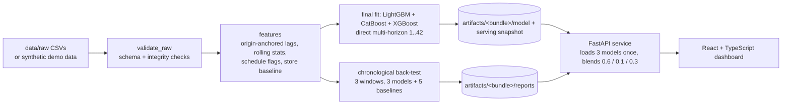

# Demand Forecasting & Analytics Platform

An end-to-end machine-learning project that forecasts daily demand for 1,115 stores up to 42 days ahead — data validation, temporal feature engineering, chronological back-testing, a **3-model boosting ensemble (LightGBM + CatBoost + XGBoost)**, a FastAPI service and an interactive React dashboard.

**Live demo:** https://demand-forecasting-platform-eight.vercel.app/ · **Repository:** https://github.com/AdityaKishore0698/demand-forecasting-platform

> **Deployment note.** This README describes the ensemble build. Until that build is redeployed, the live demo may still be serving the earlier single-LightGBM build; the app's *About* page and `/model-info` always state which model is actually running.

| Overview (light) | Overview (dark) |
|---|---|
|  |  |

<details>
<summary>More screenshots</summary>

| Forecast + "what moves this forecast" drawer | Model performance |
|---|---|
|  |  |

| Feature insights | Mobile |
|---|---|
|  |  |

</details>

> **Demo mode.** The bundled model, the screenshots and any public deployment use a **synthetic dataset** generated by this repository (`make demo`); the app shows a "Demo mode — using synthetic data" banner and every number it computes is illustrative (the Model Performance page marks live metrics as *Synthetic demo* and shows the real-dataset validation figures only in a separate, static, clearly labelled *Reported offline validation* card — never as live accuracy). The validation results below were measured on the real dataset, which is **not included** — see [Dataset](#dataset).

---

## Problem statement

Businesses that fulfil demand from many locations must plan staffing and stock weeks ahead. Given each store's daily order history, this project predicts **how many orders each store will receive on each of the next 1–42 days**, and shows how trustworthy and explainable those forecasts are. The series are related (shared weekly rhythm, promotions, holidays), have structural zeros (closed days) and are right-skewed — which shapes every modelling decision below. No business impact was measured; this is a modelling and engineering project.

## Architecture



```
src/          config, data (validation, synthetic generator), features, models (LightGBM, CatBoost, XGBoost ensemble), evaluation, forecasting (pipeline, service)
api/          FastAPI app, Pydantic schemas, routers
frontend/     React 18 + TypeScript + Vite + Recharts + TanStack Query + Framer Motion
configs/      default.yaml (your data) · demo.yaml (synthetic demo)
artifacts/    demo/ = committed ensemble bundle trained on SYNTHETIC data (≈22 MB) · demo_single/ = previous single-LightGBM synthetic bundle (rollback)
              your own bundle goes in artifacts/ (git-ignored)
experiments/  research code for the corrected ensemble evaluation (not used by the API)
tests/        96 backend tests · frontend/src/lib/format.test.ts: 4 unit tests
docs/         architecture, ML audit, corrected ensemble evaluation, EDA, experiments, deployment checklist, screenshots
```

## ML approach

Several boosting models were evaluated (LightGBM, CatBoost, XGBoost) alone and as blends. **The final deployed model is the 3-model ensemble**, a fixed-weight blend of their demand forecasts:

`forecast = 0.6 · LightGBM + 0.1 · CatBoost + 0.3 · XGBoost`  (then closed days are forced to 0)

- **Direct multi-horizon forecasting.** All three models predict the demand `h` days after a *forecast origin* (the last known day), for any `h` in 1–42. History features are frozen at the origin and `h` is a feature, so there is no recursive error compounding and no need to invent future inputs.
- **Member recipes** (fixed, not re-tuned for the deployment): LightGBM Tweedie (p = 1.05, 1,160 trees); CatBoost on `log1p(demand)` (1,320 iterations, depth 6); XGBoost Tweedie (p = 1.1, 590 rounds, depth 8). All three use the same 44 features, trained on weekly forecast origins.
- **Closed days** are known in advance and forecast as exactly 0.
- **Known-in-advance inputs only.** Schedule flags for the forecast window (open, promotion, holiday, school closure) are used; a column that exists only for past days is excluded.
- **Safe categorical handling.** XGBoost stores no category levels in the model, so scoring one store with per-frame categories would silently re-code them and change predictions (measured up to 21.6 %). The training levels are persisted and pinned at inference; tests assert single-store and full-frame predictions are identical.
- **Loaded once, inference only.** The three models are loaded at start-up and hash-verified against the model card; a request never trains or loads anything, and every forecast is checked (row/horizon order, no NaN/inf, non-negative) before it is returned.
- **Explanations are labelled by what they are.** Each model's TreeSHAP explanation is exact for that model; the ensemble-level view is a blend-weighted average, shown as **approximate**, with its reconstruction error reported.

## Feature engineering

| Group | Features |
|---|---|
| Recent demand (frozen at the origin) | lags of 1, 7, 14, 21, 28, 35, 42 days; rolling mean and standard deviation over 7 / 14 / 28 / 42 days |
| Store baseline | expanding mean; store × weekday historical average |
| Known-in-advance schedule | open, promotion, regional holiday, school closure for the target day, plus the previous and next day's flags |
| Calendar | weekday, month, day of month, week of year, weekend |
| Store attributes | store id, format, assortment tier, competitor distance / age, loyalty-programme flags |
| Horizon | `h` |

Each store's history is reindexed to a full daily calendar so "lag 7" always means seven *calendar* days (stores with gaps get missing values, not shifted rows). A column that exists only for past days (`AppSessions`) is excluded. Because the schedule is published only 42 days ahead, "next-day" flags are blanked for the last forecast day in **training, validation and serving alike**.

## Chronological validation

Strictly time-ordered (`src/evaluation/backtest.py`). For each of **three rolling 42-day windows** ending at the last known day and stepping back:

1. Training origins are chosen so every training example's **target date is on or before the window's cut-off**; `assert_no_temporal_leakage` raises otherwise.
2. All three models are trained on that data, forecast all 42 days from the cut-off, and are blended; five simple baselines (global mean, store mean, last value, same weekday last week, 7-day rolling mean) are scored identically.
3. Percentage metrics use open days only; RMSLE uses all days.

Verification (see [docs/ML_AUDIT.md](docs/ML_AUDIT.md)): features recomputed from raw data in plain pandas matched (4,200 values, 0 mismatches); four deliberately injected leaks were each caught by the tests; the horizon-42 schedule mismatch found by the audit was fixed and every model re-evaluated ([docs/ENSEMBLE_CORRECTED_EVALUATION.md](docs/ENSEMBLE_CORRECTED_EVALUATION.md)).

## Validation results

Measured on the real dataset (1,115 stores, ≈970k store-days, Jan 2013 – Jun 2015) with the corrected methodology. **These are validation results from hold-out windows, not production accuracy.**

**Primary validation window (2015-05-09 → 2015-06-19)**

| Model | RMSLE | WAPE | MAE | RMSE |
|---|---|---|---|---|
| LightGBM | 0.09472 | 6.865 % | 499.8 | 690.4 |
| CatBoost | 0.10312 | 7.715 % | 561.7 | 783.8 |
| XGBoost | 0.09550 | 6.955 % | 506.3 | 707.3 |
| **Ensemble (0.6 / 0.1 / 0.3)** | **0.09410** | **6.825 %** | **496.9** | **688.1** |
| Best simple baseline (7-day rolling average) | 0.2331 | 17.78 % | 1,294 | 1,767 |

The ensemble forecasts 75.6 % of store-days within ±10 % of the actual. WAPE is about 62 % lower than the best simple baseline.

**All three chronological windows**

| Window (42 days) | Ensemble RMSLE / WAPE | LightGBM RMSLE / WAPE | Best simple baseline WAPE |
|---|---|---|---|
| Primary 2015-05-09 → 06-19 | **0.09410** / **6.825 %** | 0.09472 / 6.865 % | 17.8 % (7-day rolling average) |
| Earlier 2015-03-28 → 05-08 | 0.10111 / 8.604 % | 0.10304 / 8.758 % | 25.4 % (last known day) |
| Earlier 2015-02-14 → 03-27 | **0.11729** / **7.512 %** | 0.11817 / 7.583 % | 18.4 % (last known day) |
| Pooled (3 windows) | **0.10462** / **7.660 %** | 0.10576 / 7.749 % | — |

The ensemble had lower error than LightGBM alone in all three windows on all four metrics (RMSLE −0.7 % to −1.9 %, WAPE −0.04 to −0.15 percentage points). The margins are small, and the ensemble was **not** the lowest-error model in every window: in the 2015-03-28 → 05-08 window XGBoost alone was marginally lower (RMSLE 0.10110 vs 0.10111). CatBoost had the highest error of the three in every window.

**How to read these numbers**

- The archived round counts and the 0.6 / 0.1 / 0.3 weights were chosen on the **primary window** under an earlier methodology, so the primary-window score is a *validation* result, not an untouched test result, and is the window most favourable to this recipe. The two earlier windows were not used to choose them but are from the same dataset and period.
- No weights, tree counts or hyper-parameters were tuned on these corrected results.
- The deployed model is retrained on all history; its accuracy on the forecast window **cannot be measured** (actuals are not in the data).
- Point forecasts only — no prediction intervals. Store-level bootstrap intervals in the evaluation document reflect which stores are in a window only; no broader statistical claim is made.
- An earlier version of the pipeline let training and back-testing see the next-day schedule flag on the last forecast day, which the API cannot have. That was corrected in training, validation and serving; all figures above are post-correction ([docs/ML_AUDIT.md](docs/ML_AUDIT.md) §3).

## Engineering footprint of the ensemble

The ensemble adds model footprint and inference complexity compared with a single LightGBM. Measured on one laptop (not a statement about any hosting plan):

| | Single LightGBM | 3-model ensemble |
|---|---|---|
| Training time per fit (5.1 M rows) | ~2 min | ~34 min (CatBoost is ~84 % of it); final fit on all 5.37 M rows: 37 min |
| Model files, real-data bundle | ≈ 21.7 MB raw (8.4 MB gzipped) | 88.4 MB (LightGBM 8.4 gz + CatBoost 17.6 + XGBoost 62.4 UBJSON) |
| Whole-API process memory after start (real-data bundle, includes the 970k-row history) | 548 MB | 710 MB |
| 42-day forecast, HTTP, uncached (median) | 14 ms | 23 ms |
| Extra Linux dependencies | — | +448 MB (`catboost`, `xgboost` and their dependencies) |

Full pipeline run for the ensemble on the real data (3 back-test windows, final fit, importance): 2 h 19 min on this laptop. The pipeline's three windows reproduced the corrected evaluation figures above. The synthetic **demo bundle** is smaller (22 MB of files); in the Docker image built here it used ≈254 MiB after start-up, answered `/health` 1.8 s after the container started, served an uncached 42-day forecast in ≈19 ms end to end and an explanation in ≈77 ms. The image is ≈1.31 GB on disk.

## API

FastAPI + Pydantic. Interactive docs at `/docs`. Invalid input → `422`, unknown store → `404`, missing/corrupt artifacts → `503` (with a degraded `/health`), failed internal consistency check → `500` with the reason.

| Method | Path | Purpose |
|---|---|---|
| GET | `/health` | Liveness, model loaded, model type and components, version, data-through date, data label |
| GET | `/stores` | Stores with attributes, average demand, per-store hold-out WAPE |
| GET | `/historical-data?store_id=&days=` | Recorded demand + summary |
| POST | `/forecast` | `{ "store_id": 42, "horizon": 14 }` → daily forecast, summary, notes |
| GET | `/explain?store_id=&date=` | Exact TreeSHAP per model + a labelled-approximate ensemble view |
| GET | `/metrics` · `/backtest` | Hold-out metrics (incl. per-member), baselines, windows · actual vs predicted |
| GET | `/feature-importance` | Permutation (on the ensemble), SHAP and gain importance, per model where relevant |
| GET | `/model-info` · `/dataset-info` | Model card (type, weights, components, versions, hashes) · dataset facts |

## Interactive dashboard

React 18 + TypeScript. **Overview** (KPIs, history→forecast chart, trend, weekly pattern) · **Forecast** (store/horizon controls, table with context, per-day driver panel with an ensemble/per-model selector, CSV export) · **Model Performance** (synthetic-demo metrics vs baseline, ensemble members, a static card of reported real-dataset validation results, actual vs predicted, error distribution, error by horizon / weekday / store size / promotion, robustness across windows) · **Feature Insights** · **About**. Light and dark themes (persisted, no flash), loading / empty / error / API-offline states, responsive down to phone width.

## Tech stack

Python · pandas / NumPy · LightGBM · CatBoost · XGBoost · FastAPI · Pydantic v2 · Uvicorn · pytest — React 18 · TypeScript (strict) · Vite · Recharts · TanStack Query · Framer Motion — Docker (API), Render + Vercel (deployment target).

## Local setup

Requires Python 3.9+ and Node 20.19+ / 22.12+. **No data download is needed.**

```bash
make install            # pip install -r requirements-dev.txt   (includes catboost and xgboost)
make api                # http://localhost:8000 (docs at /docs) — serves the synthetic demo ensemble

make install-frontend   # in a second terminal: npm ci
cp frontend/.env.example frontend/.env.local
make frontend           # http://localhost:5173

make test               # 96 backend tests
make test-frontend      # type-check + production build + unit tests
```

If port 8000 is busy: `make api API_PORT=8010` and set `VITE_API_URL=http://127.0.0.1:8010` in `frontend/.env.local`. Docker: `make docker` (the image contains the demo ensemble bundle and, as a rollback target, the previous single-LightGBM demo bundle: set `ARTIFACT_DIR=/app/artifacts/demo_single` to use it).

## Demo mode

The repository ships a bundle (`artifacts/demo/`, ≈22 MB) of the **same ensemble architecture and hyper-parameters**, trained on **synthetic** data produced by `make demo` (`src/data/synthetic.py`, `configs/demo.yaml`; ≈15 minutes). The API serves it by default, `/health` reports `data_label: synthetic-demo`, and the UI shows **"Demo mode — using synthetic data"**. Metrics displayed in demo mode are computed on the synthetic data (there the ensemble is *not* the best member — CatBoost is), so they are illustrative and are not the results above. To train on your own data, place it in `data/raw/` and run `make train` (≈2.3 hours on a laptop CPU for 3 back-test windows plus the final fit of three models) — the API then serves that bundle instead (`artifacts/` is git-ignored).

## Dataset

- **Dataset:** *Rossmann Store Sales* — **Source:** Kaggle, <https://www.kaggle.com/c/rossmann-store-sales>.
- **The original dataset is not included in this repository**, and no data derived from it is published. It is a third-party dataset; its terms are the source's, not this project's. Please obtain it there.
- **Synthetic demo data is included** (generated by code) for reproducibility and demonstration only.
- The modelling, pipeline, API and dashboard code is my own independent implementation. Column names and the expected file layout are in [data/README.md](data/README.md).

## Limitations

- Static historical dataset (ends mid-2015); the app is not connected to live data.
- Validation caveats above; no measured accuracy on the forecast window; small ensemble margins that are not uniform across windows.
- Only schedule information known in advance is modelled — no weather, price or competitor-event data.
- Point forecasts only; one global ensemble for all stores; no cold-start path for brand-new stores.
- The ensemble-level explanation is an approximation (per-model explanations are exact).
- The ensemble is heavier to train, package and serve than a single model (table above); hosting-plan compatibility has to be checked against your instance's limits.
- No drift monitoring or automated retraining.

## Future improvements

Prediction intervals (quantile objectives or conformal prediction) · drift monitoring and scheduled retraining with a promotion gate · an untouched final evaluation window · a fallback path for cold-start stores · re-deriving round counts and blend weights on windows other than the primary one.

## License

Source code, configuration and documentation: [MIT](LICENSE) © Aditya Kishore. The licence covers this project's own work only — **not** the Rossmann dataset, which is third-party and not included.

## Documentation

[ARCHITECTURE](docs/ARCHITECTURE.md) · [ML_AUDIT](docs/ML_AUDIT.md) · [ENSEMBLE_CORRECTED_EVALUATION](docs/ENSEMBLE_CORRECTED_EVALUATION.md) · [EDA](docs/EDA.md) · [EXPERIMENTS](docs/EXPERIMENTS.md) · [DEPLOYMENT_CHECKLIST](docs/DEPLOYMENT_CHECKLIST.md)
